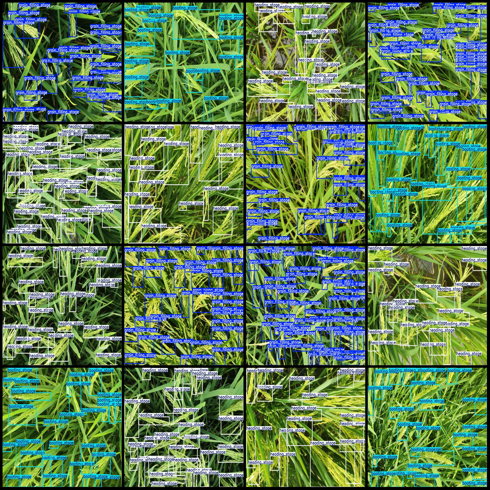
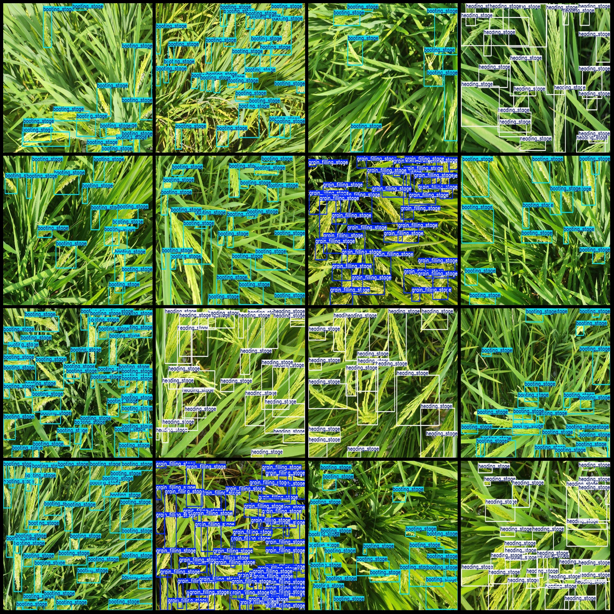

# Drone-Viewed Intelligent Agriculture Rice Growth Cycle and State Detection Dataset - VOC+YOLO Format, 5413 Images in 3 Categories

Dataset format: Pascal VOC format plus YOLO format (without split paths in txt files, only containing jpg images along with corresponding VOC format xml files and YOLO format txt files)
Number of images (jpg file count): 5413
Number of annotations (xml file count): 5413
Number of annotations (txt file count): 5413
Number of annotation categories: 3
Annotation category names in the yolo format (noting that the order of labels in the yolo format does not correspond to this, but rather according to the "labels" folder's "classes.txt"): 
["booting_stage", "grain_filling_stage", "heading_stage"]
Number of bounding boxes per category:
booting_stage (pre-grain filling stage) bounding box count = 40637, occupied image count = 2270
grain_filling_stage (tillering stage) bounding box count = 64419, occupied image count = 1614
heading_stage (tasseling stage) bounding box count = 39643, occupied image count = 1639
Total bounding box count: 144699
Image resolution: 1066x800
Annotation tool used: labelImg
Annotation rules: drawing bounding boxes for categories
Important note: The dataset does not have a division into training/validation/testing sets; you will need to manually divide them.
Special declaration: This dataset does not guarantee any accuracy of the trained models or weight files.
Image preview:

## Images

Here is a pay link on Stripe ( https://buy.stripe.com/3cs8yP7sY87d0vu9AB ). Please contact me lonlonago@foxmail.com after funding $89, and I will send you a complete data files , thank you!

